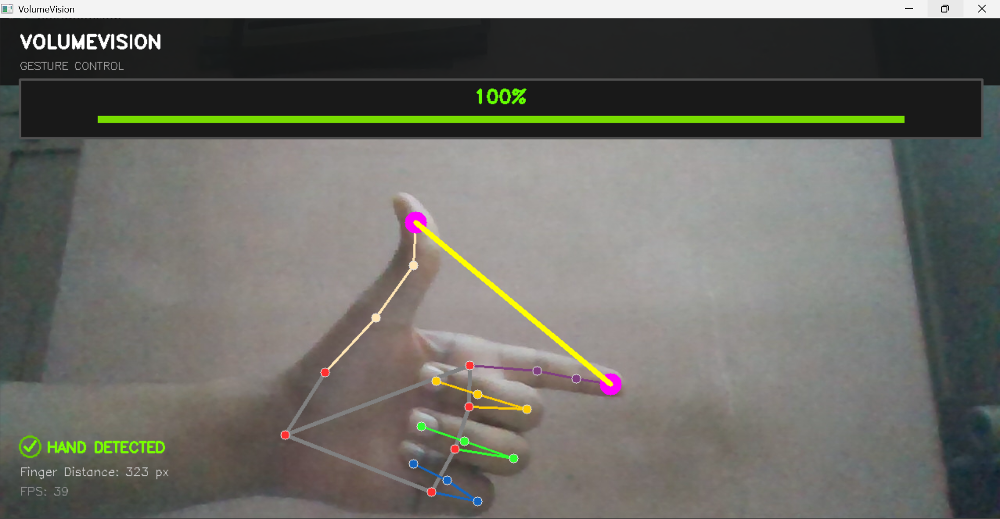
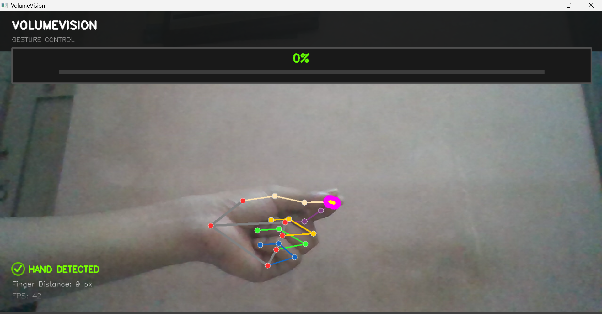

# VolumeVision 🎛️

### Real-Time Hand Gesture Volume Control

VolumeVision is a real-time computer vision project that lets users control the Windows system volume with hand gestures.

VolumeVision uses the distance between the *thumb tip and index finger tip** to control the system volume. When the fingers are close together the volume goes down. When the fingers move apart the volume goes up.

## Features

* 🎥 Real-time webcam hand tracking

* ✋ Hand landmark detection using MediaPipe

* 🔊 Gesture-based Windows volume control

* 📏 Finger-distance based volume mapping

* 📊 Real-time volume percentage display

* 📈 Volume progress bar

* ⚡ FPS monitoring

* ✅ Hand detection status indicator

* 🪞 Mirrored camera view

* 🎨 modern HUD interface

## 🛠️ Technologies Used

* Python

* OpenCV

* MediaPipe

* NumPy

* Pycaw

## ⚙️ How It Works

VolumeVision follows these steps:

1. Captures video from the webcam.

2. Detects the users hand using MediaPipe.

3. Identifies the thumb and index finger landmarks.

4. Calculates the distance between the two fingertips.

5. Maps the distance to the Windows system volume range.

6. Updates the system volume in time.

7. Displays the volume and hand-tracking information, on screen.

### Gesture Control

```text

Thumb + Index Finger

🤏

↓

Short distance  → Lower volume

🤌

↓

distance   → Higher volume

```

## 📦 Installation

### 1. Clone the repository

```bash

git clone https://github.com/YOUR_USERNAME/VolumeVision.git

```

### 2. Open the project

```bash

cd VolumeVision

```

### 3. Create an environment

```bash

python -m venv env

```

### 4. Activate the environment

#### Windows PowerShell

```powershell

.\env\Scripts\Activate.ps1

```

#### Windows Command Prompt

```cmd

env\Scripts\activate

```

### 5. Install dependencies

```bash

pip install -r requirements.txt

```

## ▶️ Run the Project

Run:

```bash

python vv.py

```

Your webcam will open. Volumevision will begin detecting your hand.

Use the following gesture:

* Move your thumb and index finger to lower the volume

* Move your thumb and index finger farther apart to raise the volume

Press **ESC** to exit the application.

## 💻 Requirements

* Windows operating system

* Python 3.11 recommended

* Working webcam

* Microphone is not required

* Internet connection is required when installing dependencies

## 📸 Project Preview

Add a screenshot of the application here:

```markdown






```

## 🚀 Future Improvements

* Add a mute/unmute gesture

* Support multiple hand gestures

* Add brightness control

* Add media playback controls

* Add gestures

* Improve gesture smoothing

* Add -platform audio support

## 👨‍💻 Author

**Shahez Shaik**

GitHub: https://github.com/Shahezshaik

---

If you find this project interesting consider giving the repository a star!